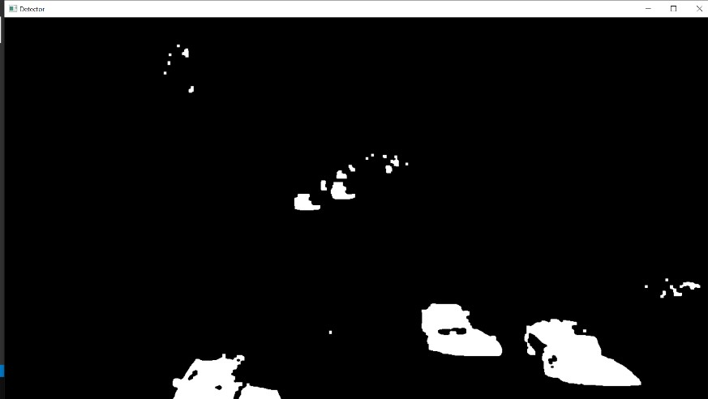
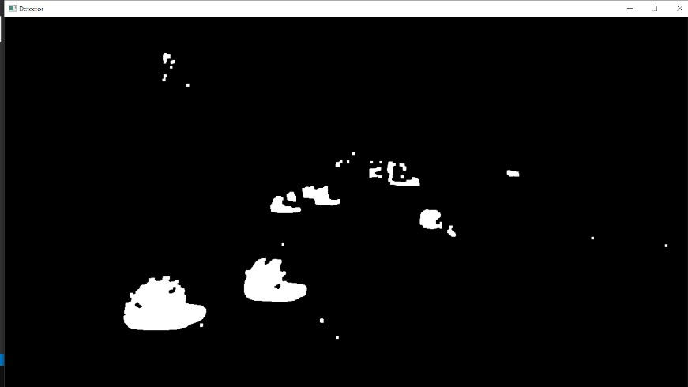

# Vehicle-Detection

This repo contains files and codes related to the CV project offered by Stamatics, IITK in summers of 2021.

## About Our Project 
We have done vehicle detection, tracking and classification by contour extraction. The algorithm used is background subtraction, more specifically we have used **Background Subtractor MOG.**

## Data for Execution
This task requires only a video: The video might contain vehicles for detection. 

## Dilation
 

## Output 
This is the detection done by our model.

## Model
Following are the steps followed:
1) Load the video.
2) Extract images from the video, frame by frame.
3) Study difference between foreground(moving vehicles) and background(static things).
4) After this, Background subtraction; image enhancement and Foreground Extraction is done.
5) Further, image pre-processing is done using Dilation and Erosion.
6) Then, contours are extracted and then number of Vehicles are counted using them.

## Conclusion and Limitations 
There is a great amount of potential applications of vehicle identification and tracking on expressways and highways due to traffic congestion. We have developed a vision-based system for effective detection and counting of vehicles on the road in this study.  
**A drawback of the project is that setting the region of interest requires human intervention. For vehicle counting, the user must draw an imaginary line where the center of the contours intersects thus, the accuracy is dependent on the human supervisor's opinion.
Furthermore, because the camera angle has an impact so camera calibration techniques could be employed to detect vehicles with an increased efficiency. Also, the project would be unable to detect automobiles at night since it requires foreground objects to be visible in order to extract contour properties and features for classification.**

**Team: Ashok Jyani, Sparsh Sihotiya and Ujjwal Agarwal; Offered by : Shivanshu Tyagi and Akshay Gupta**

