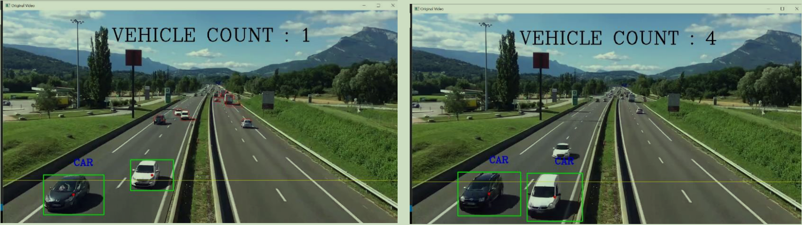

# Vehicle-Detection

This repo contains files and codes related to the CV project offered by Stamatics, IITK in summers of 2021.

## About Our Project 
We have done vehicle detection, tracking and classification by contour extraction. The algorithm used is background subtraction, more specifically we have used background subtractor MOG.

## Data for Execution
This task requires only a video: The video might contain vehicles for detection.

## Output 
This is the detection done by our model.

## Model
Following are the steps followed:
1) Load the video.
2) Extract images from the video, frame by frame.
3) Study difference between foreground(moving vehicles) and background(static things).
4) After this, Background subtraction; image enhancement and Foreground Extraction is done.
5) Further, image pre-processing is done using Dilation and Erosion.
6) Then, counters are extracted and then number of Vehicles are counted using them.

Team: Ashok Jyani, Sparsh Sihotiya and Ujjwal Agarwal; Offered by : Shivanshu Tyagi and Akshay Gupta

